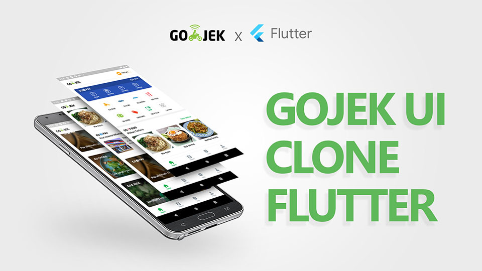
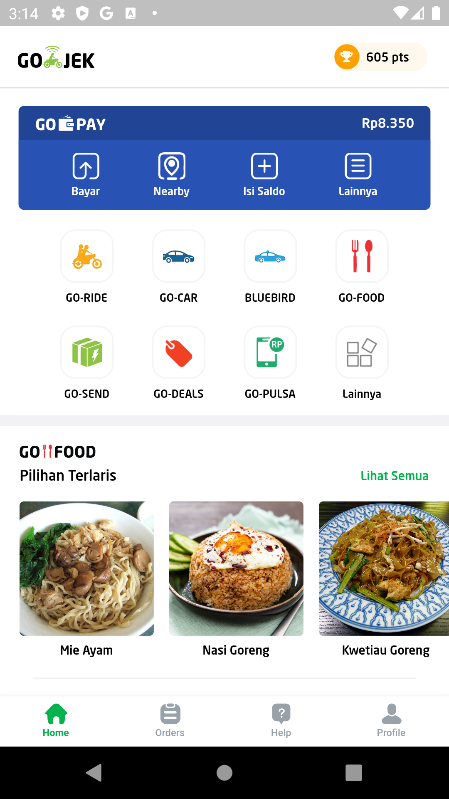
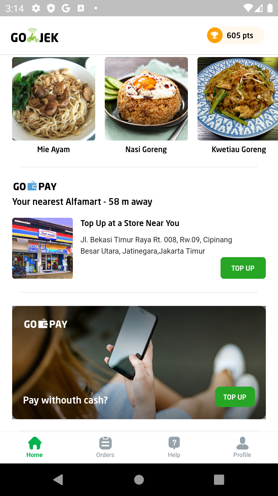

# Gojek UI Clone 🛵

A beautiful and pixel-perfect clone of the Gojek App UI, built with Flutter. This project demonstrates complex UI implementation in Flutter, featuring a responsive design and smooth interactions.

[](https://flutter.dev/)
[](https://dart.dev/)

## 📱 Screenshots

<div align="center">
  
</div>
<br/>

<div align="center">
  
  
  
</div>

## ✨ Features

- **Home Screen**: Comprehensive home layout with custom app bar and bottom navigation.
- **Gopay Integration (UI)**:
  - Balance display
  - Quick action buttons: Pay, Nearby, Top Up, and More.
- **Service Menu Grid**:
  - GO-RIDE, GO-CAR, BLUEBIRD
  - GO-FOOD, GO-SEND, GO-DEALS
  - GO-PULSA and extended menu options.
- **Promo Section**: Horizontal scrolling promo banners.
- **Bottom Navigation**: Easy access to Home, Orders, Help, and Profile.
- **Custom Icons & Assets**: exact replication of Gojek's iconography.

## 🛠 Minimum Requirements

- **Flutter SDK**: `>=3.0.0 <4.0.0`
- **Dart SDK**: Compatible with Flutter SDK version

## 🚀 How to Run

1. **Clone the repository**

   ```bash
   git clone https://github.com/AloisiusBagas/Gojek-App-Clone.git
   ```

2. **Navigate to the project directory**

   ```bash
   cd Gojek-App-Clone
   ```

3. **Install dependencies**

   ```bash
   flutter pub get
   ```

4. **Run the app**
   ```bash
   flutter run
   ```

## ⚠️ Disclaimer

This project is for **educational purposes only**. It is not affiliated with Gojek.
Content typically subject to copyright includes but is not limited to:

- Logos
- Icons
- Images
- Fonts

Please respect the intellectual property rights of the original creators.
